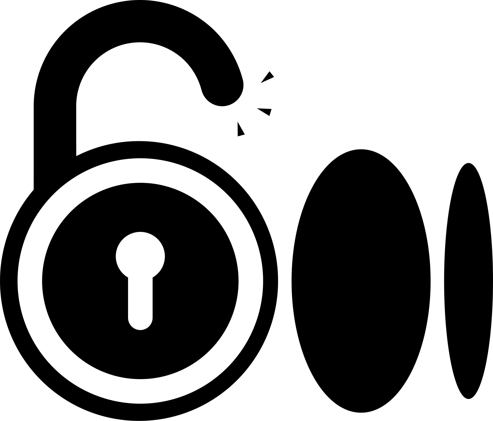

  

# Medium Unlocker

**End-to-end paywall bypasser built from scratch around the freedium.cfd index.**

  

## ✨ Features

## Project Background

- Medium’s “3 free reads” wall is frustrating for casual browsing.  
- freedium.cfd hosts publicly cached versions of Medium stories, but there was no polished way to reach them.  
- Medium Unlocker bridges that gap with a custom UI, tailored network stack, and automation that lets readers paste or share a Medium URL and instantly open the matching freedium mirror.

---

## Feature Highlights

### Web
- **Purpose-built frontend** – React 18 SPA with a bespoke dark interface.
- **URL normalizer** – Cleans Medium query noise and rewrites the slug for freedium.
- **Result inspector** – Shows whether the article was fetched from cache or proxied live.
- **Share-ready links** – Generates clean freedium URLs you can copy anywhere.

### Android
- **Native shell** – Java + WebView with Material Design 3 styling.
- **One-tap share target** – Appears inside the Android share sheet for any Medium link.
- **Inline resolver** – Performs the same URL normalization on-device, then loads freedium in a hardened WebView.
- **Mirror Support** – Automatically switches to `freedium-mirror.cfd` if the primary server is blocked.
- **Smart Auto-Retry** – Seamlessly detects connection failures and retries with the mirror server.
- **Network extras** – Optional DoH, proxy toggles, custom SSL pinning for freedium’s cert chain.

---

## Quick Start

### Web
1. Go to [medium-unlocker.inulute.com](https://medium-unlocker.inulute.com).
2. Paste any Medium article URL.
3. Hit **Unlock** and read the freedium mirror.

### Android
1. [Grab the latest APK](https://github.com/inulute/medium-unlocker/releases/latest).
2. Install (you may need to allow side-loading).
3. Either:
   - Share a Medium link and pick **Medium Unlocker**, or
   - Open the app, paste a URL, tap **Unlock**.

---

## Tech Stack

| Layer        | Stack                                                                 |
|--------------|----------------------------------------------------------------------|
| Web          | React 18, Vite tooling, CSS Modules, Inter font, Cloudflare Pages    |
| Android      | Java, Material 3, OkHttp, WebView   |

---

## Disclaimer

> [!WARNING]
> Educational use only. You are responsible for respecting Medium’s Terms of Service and regional laws. This project does not host Medium content; it automates requests to freedium.cfd.

> [!NOTE]
> freedium.cfd is a public mirror. Its uptime, indexing speed, and article availability are outside my control.

> [!WARNING]
> **For Educational Purposes Only**
>
> This tool is provided for educational purposes to demonstrate web scraping and proxy techniques. Users are responsible for complying with Medium's Terms of Service and applicable laws. The developers are not responsible for any misuse.

> [!NOTE]
> **Service Availability**
>
> This tool relies on freedium.cfd, a third-party service. Availability and functionality may vary. Some articles may not be accessible if not indexed by the service.

---

## 🤝 Contributing

## Feedback & Support

- Issues: [GitHub Issues](https://github.com/inulute/medium-unlocker/issues)
- Ideas: [Discussions](https://github.com/inulute/medium-unlocker/discussions)
- Contact: [socials.inulute.com](https://socials.inulute.com)
- Helpdesk: [support.inulute.com](https://support.inulute.com)

---

## Donate

  

---

## License

MIT License – see [`LICENSE`](https://github.com/inulute/medium-unlocker/blob/main/LICENSE) for details.

  

---

## Credits

- **freedium.cfd** – public cache the project is built around.
- **Material Design + React teams** – foundational tooling.

---

**Created by [inulute](https://github.com/inulute)**  
[Website](https://medium-unlocker.inulute.com) • [Download](https://github.com/inulute/medium-unlocker/releases/latest) • [Support](https://support.inulute.com) • [GitHub](https://github.com/inulute)

